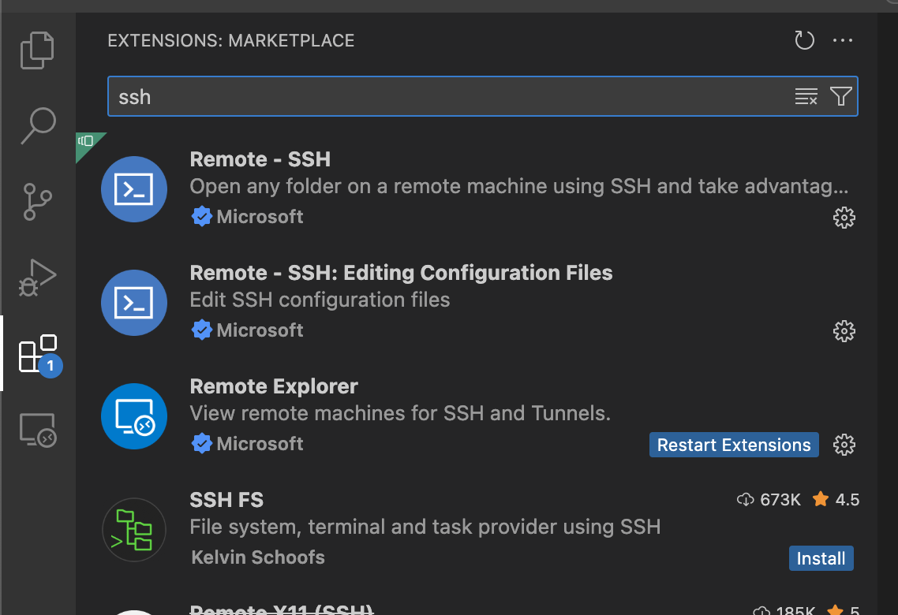

# Day 1: Before the tutorials

Owner: Suman

# 1. Connecting to Expanse through VS Code

1. Get VS Code for your OS from:https://code.visualstudio.com/Download. Install is accordingly. 
2. In the extension tab search for “Remote SSH”. Click on the first one and click on install.
    
    
    
3. After installing it, in the bottom left corner you will see the green “><” button which says “open a remote window”. Click on that
    
    
    
4. Click on “connect to host” followed by “+ Add New SSH Host”
    
    
    
5. There add `ssh username@login.expanse.sdsc.edu` . Make sure to use your `username`. Then add it to your laptops default path, which should look like this `/User/username/.ssh/config` for mac users.
6. Now ssh host is added. Again click on the green “><” button on bottom left corner again. Then click “connect to host” followed by “login.expanse.sdsc.edu”. It will open another VS Code window and ask for password and TOTP (from your authenticator app). It will take some time If it successfully connected it will show something like this
    
    
    
7. Now you should in your folder. On top menu bar click on “Terminal” → “New Terminal”
    
    
    
8. Now we’ll be activating our shared Conda env. For that copy and paste the following command in the terminal and press enter.
    
    ```bash
    /expanse/projects/qstore/csd973/anaconda/anaconda3/bin/conda init
    ```
    
    Then do `bash`  and enter to refresh the terminal. Now you should see `(base) [username@login01 ~]` - something this. This means we have activated the conda env.
    
9. We will now activate the conda env by: `conda activate qdms_2025`
10. We will create a local ipykernel using the following command
    
    ```bash
    python -m ipykernel install --user --name qdms --display-name "Python (qdms)"
    ```
    

# 2. Get files from Github

1. Click on “Open Folder”. 
    
    
    
    Type `/expanse/lustre/projects/csd973/` and look for your username (or start typing your username). Click onto that folder and press “OK”. Then you need to give permission that “Yes, I trust the authors” to open the folder through VS Code.
    
    
    
2. Open an terminal and clone the QDMS_2025 repo by using the following command
    
    ```bash
    git clone git@github.com:paesanilab/QDMS_2025.git
    ```
    

# 3. Connecting to a Kernel in Jupyter Notebook

1. After opening a jupter-notebook click on “select kernel” on top right corner then click on “Python Environments”. There you would see the ipykernel that we have created “Python (qdms)”

---

[archive](https://www.notion.so/archive-22f6625b069080528abaf92856a8c260?pvs=21)